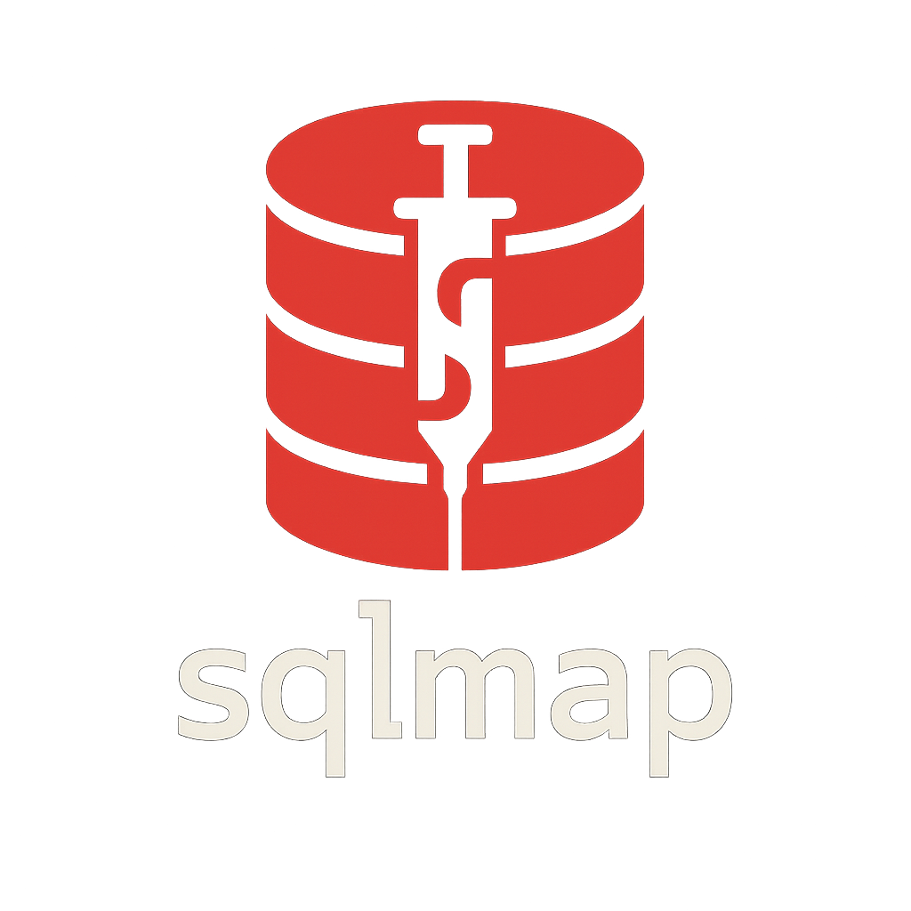

---

  

---

<h1 align="center" style="font-size:36px;">🌐 Welcome to my GitHub!</h1>

  I'm <strong>Paulo G. Werneck</strong>, passionate about <strong>offensive security</strong>, always exploring new cybersecurity tools and techniques, and sharing them here.

  Want to know more about me? Check out my portfolio and LinkedIn below:

  
  &nbsp;
  

# 👾 Offensive Security Analyst & Cybersecurity Enthusiast

💀 Focused on Offensive security.  

⚙️ Exploring vulnerabilities, developing tools, and studying threat evasion techniques.

🚩 CTF Player.

     
## 🛠️ Tech Stack

 
  
  
  
  
  
  
  
  
  
  
  
  
  
  
  
  
  

 

## 🥇 **Certifications & Badges**

| Badge | Cert |
|:-----:|:----:|
| 
 <strong>Microsoft SC-900</strong>
 | 
 <strong>Pentest do Zero ao Profissional v2023</strong>
 |

<!-- Divider -->

## 🔜 **Upcoming Certifications**

<table>
  <!-- Linha 1 – logos + títulos -->
  <tr>
    <td align="center" width="160">
       
      <strong>CompTIA CySA+</strong>
    </td>
    <td align="center" width="160">
       
      <strong>eJPT</strong>
    </td>
    <td align="center" width="160">
       
      <strong>CompTIA Security+</strong>
    </td>
    <td align="center" width="160">
       
      <strong>CPTS (HackTheBox)</strong>
    </td>
    <td align="center" width="160">
       
      <strong>OSCP (Offensive Security)</strong>
    </td>
    <td align="center" width="160">
       
      <strong>eWPTX v2</strong>
    </td>
  </tr>

  <!-- Linha 2 – barras de progresso -->
  <tr>
    <td align="center">
      
    </td>
    <td align="center">
      
    </td>
    <td align="center">
      
    </td>
    <td align="center">
      
    </td>
    <td align="center">
      
    </td>
    <td align="center">
      
    </td>
  </tr>
</table>

<!-- Divider roxa -->

## ⚡ **Key Skills**
- 🌐 **Web Vulnerabilities**: Exploiting SQL Injection, XSS, CSRF, and authentication flaws  
- 🧩 **Reverse Engineering**: Binary analysis and decompilation  
- 🛡️ **Malware Analysis**: Research and creation of proof-of-concept threats  
- 📜 **Offensive Security**: Vuln Web, Exploits, persistence mechanisms, and evasion techniques  

<!-- Divider roxa -->

## 💻 **TryHackMe**
<!---->

  <a href="https://tryhackme.com/p/krpt">
    
    

<!-- KRPT{y0u-f0und-4-fl4g} -->

<!-- Divider roxa -->

## 💻 **HackTheBox**

> ⚠️ In progress...

<!-- Divider roxa -->

## 📈 **Stats**
<!--

  

-->

  

<!-- Divider roxa -->

## 🐍 **Contributions**

  

<!-- Divider roxa -->

## 🌐 **Connect with me**

  
  
  

<!-- Divider roxa -->

> **"The world is a dangerous place, not because of those who do evil, but because of those who look on and do nothing."**
