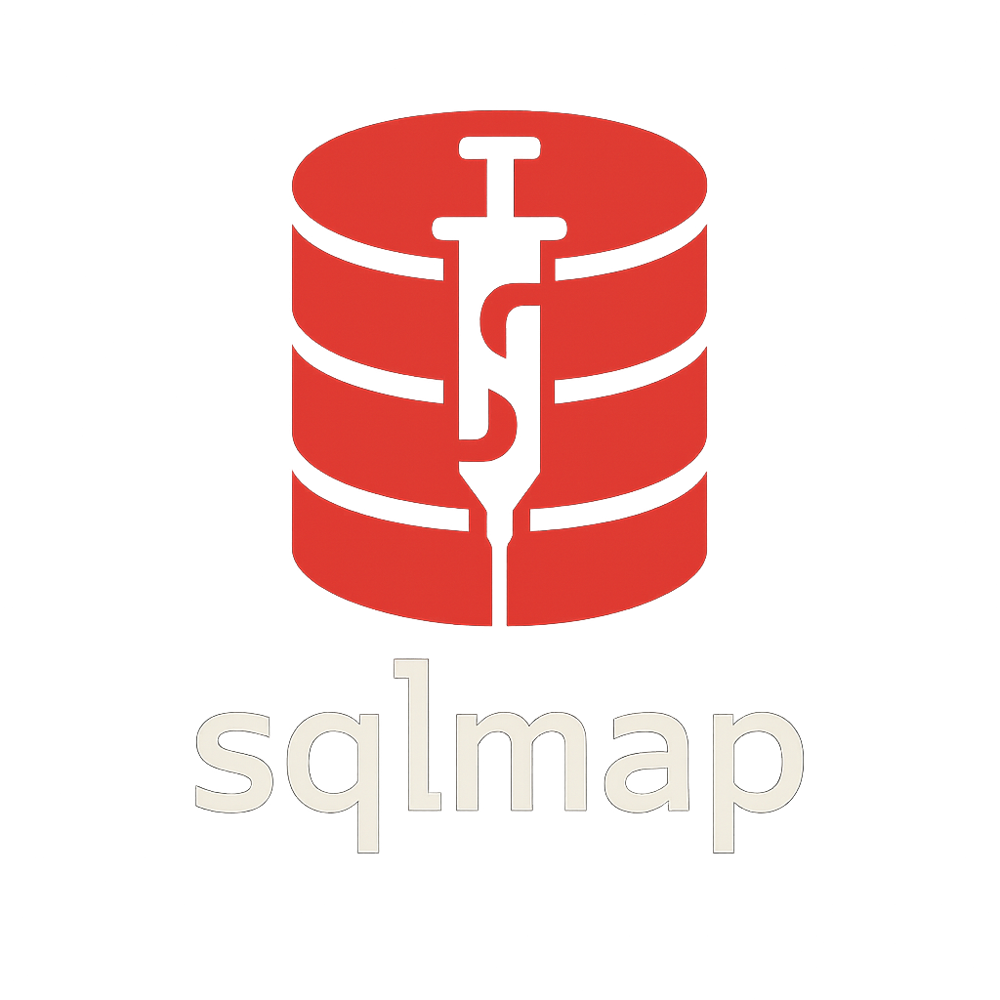
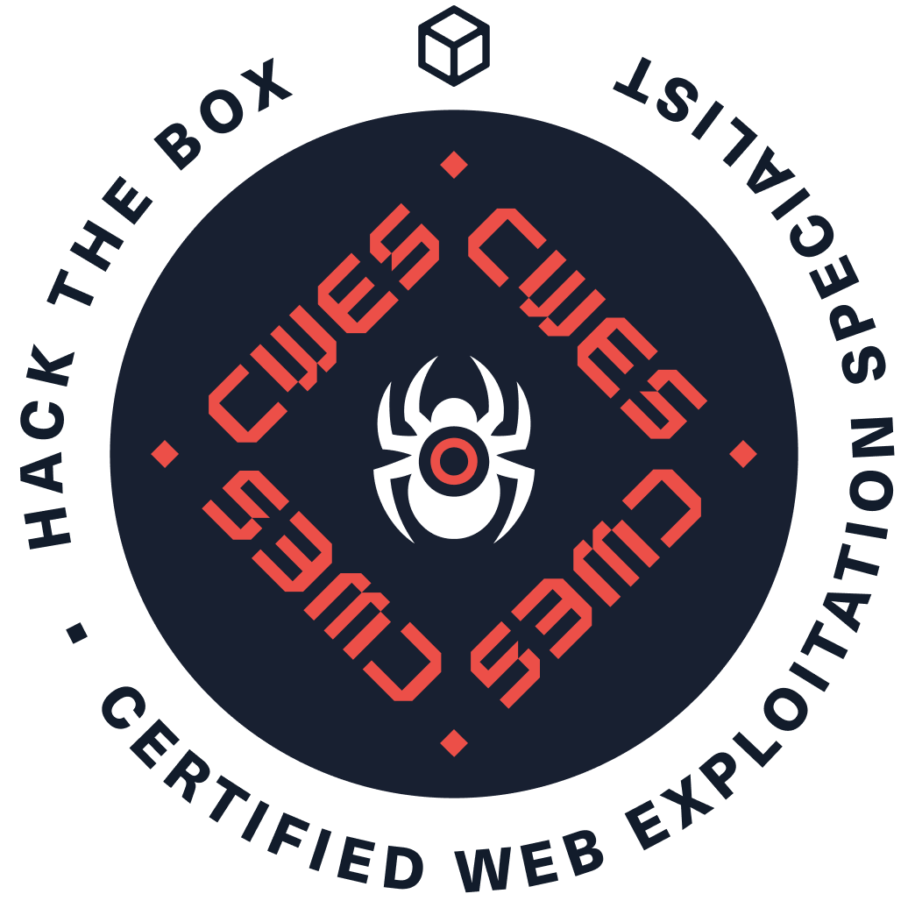
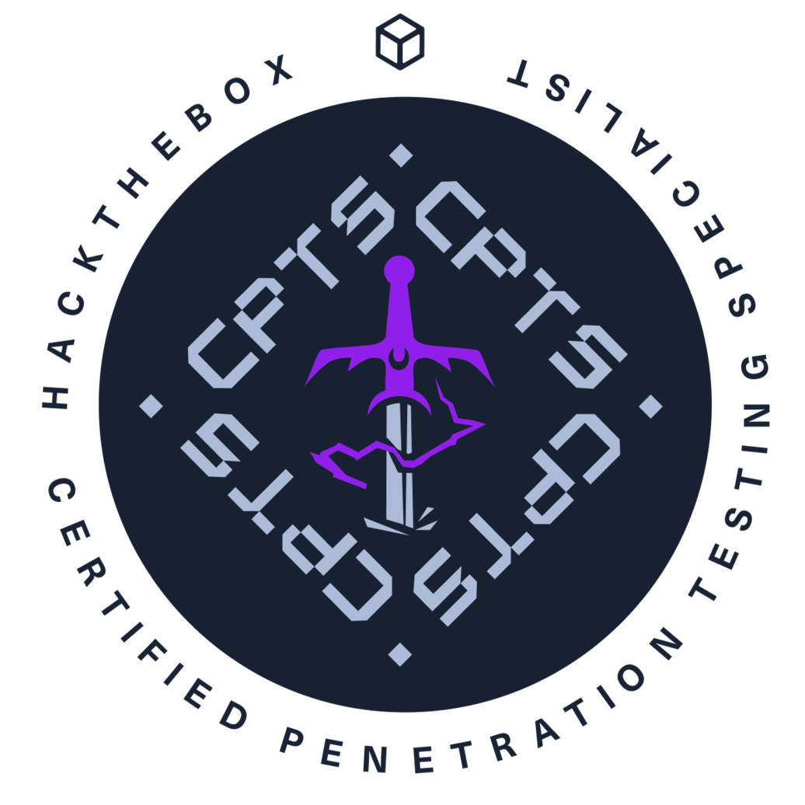
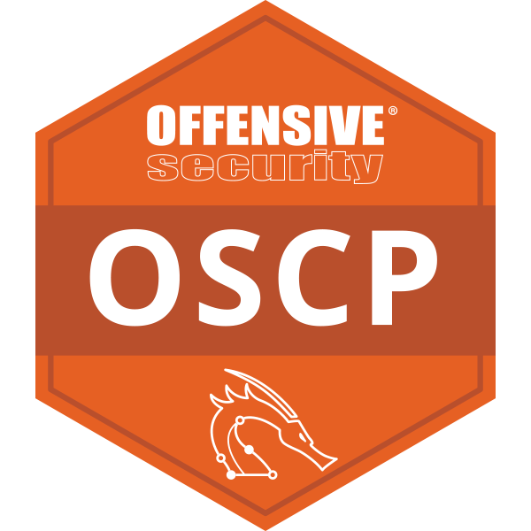
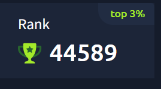

  

<h1 align="center">🌐 Welcome to my GitHub!</h1>

  I'm <strong>Paulo G. Werneck</strong>, passionate about <strong>offensive security</strong>. 
  I'm always learning, testing tools, and sharing techniques that I find useful.

  
  &nbsp;
  

## 👾 Offensive Security Analyst & Cybersecurity Enthusiast

💀 Focused on **Offensive Security** — penetration testing, vulnerability research, and threat modeling.

⚙️ Exploring vulnerabilities, developing tools, and studying **threat evasion techniques**.

🚩 **CTF Player** — solving challenges on TryHackMe and HackTheBox.

## 🛠️ Tech Stack

  
  
  <!---->
  
  
  
  
  
  
  
  
  
  
  
  
  
  

 

## 🥇 Certifications & Badges

| Badge | Cert | Badge |
|:--:|:--:|:--:|
| 
 <strong>Microsoft SC-900</strong>
 | 
 <strong>Pentest do Zero ao Profissional v2023</strong>
 | 
 <strong>INE eJPT v2</strong>
 |

## 🔜 Upcoming Certifications

<table>
  <tr>
    <td align="center" width="160">
       
      <strong>CRTA CyberWarfare</strong>
    </td>
    <td align="center" width="160">
       
      <strong>CWHI HackingClub</strong>
    </td>
    <td align="center" width="160">
       
      <strong>eWPTXv2 eLearnSecurity</strong>
    </td>
    <td align="center" width="160">
       
      <strong>CWES HackTheBox</strong>
    </td>
    <td align="center" width="160">
       
      <strong>CPTS HackTheBox</strong>
    </td>
    <td align="center" width="160">
       
      <strong>OSCP Offensive Security</strong>
    </td>
  </tr>
  <tr>
    <td align="center"></td>
    <td align="center"></td>
    <td align="center"></td>
    <td align="center"></td>
    <td align="center"></td>
    <td align="center"></td>
  </tr>
</table>

## ⚡ Key Skills

- 🌐 **Web Vulnerabilities** — Exploiting SQL Injection, XSS, CSRF, and authentication flaws
- 🧩 **Reverse Engineering** — Binary analysis and decompilation
- 🛡️ **Malware Analysis** — Research and proof-of-concept threat development
- 📜 **Offensive Security** — Exploits, persistence mechanisms, and evasion techniques

## 🎯 TryHackMe

  
  

<!-- KRPT{y0u-f0und-4-fl4g} -->

## 🟩 HackTheBox

> ⚠️ In progress...

## 📈 Stats

  

## 🐍 Contributions

  

## 🌐 Connect with me

  
  
  

> **"The world is a dangerous place, not because of those who do evil, but because of those who look on and do nothing."**
