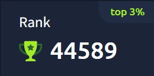

---

  

---

Welcome to my GitHub! I'm Paulo G. Werneck, passionate about offensive security and always exploring new cybersecurity tools and techniques, and sharing them here.

Want to know more about me? Check out my portfolio below and explore my projects:

---

# 👾 Offensive Security Analyst & Cybersecurity Enthusiast

💀 Focused on Offensive security.  

⚙️ Exploring vulnerabilities, developing tools, and studying threat evasion techniques.

🚩 CTF Player.

---

## 🛠️ **Tech Stack**

 
  
  
  
  
  
  
  
  
  
  
  

---

## 🥇 **Certifications & Badges**

| Badge | Cert |
|:-----:|:----:|
| 
 <strong>Microsoft SC-900</strong>
 | 
 <strong>Pentest do Zero ao Profissional v2023</strong>
 |

---

## 🔜 **Upcoming Certifications**

<table>
  <tr>
        <!-- Comptia CySA+ (90%) -->
    <td align="center">
       
      <strong>Comptia CySA+</strong> 
      
    </td>
    <!-- Comptia Security+ (10%) -->
    <td align="center">
       
      <strong>Comptia Security+</strong> 
      
    </td>
    <!-- eJPT (20%) -->
    <td align="center">
       
      <strong>eJPT</strong> 
      
    </td>
    <!-- CPTS (HackTheBox) (50%) -->
    <td align="center">
       
      <strong>CPTS (HackTheBox)</strong> 
      
    </td>
    <!-- OSCP (OffSec) (0%) -->
    <td align="center">
       
      <strong>OSCP (Offensive Security)</strong> 
      
    </td>    
  </tr>
</table>

---

## ⚡ **Key Skills**
- 🌐 **Web Vulnerabilities**: Exploiting SQL Injection, XSS, CSRF, and authentication flaws  
- 🧩 **Reverse Engineering**: Binary analysis and decompilation  
- 🛡️ **Malware Analysis**: Research and creation of proof-of-concept threats  
- 📜 **Offensive Security**: Vuln Web, Exploits, persistence mechanisms, and evasion techniques  

---
## 💻 **TryHackMe**
<!---->

  <a href="https://tryhackme.com/p/krpt">
    
    

<!-- KRPT{y0u-f0und-4-fl4g} -->

---

## 💻 **HackTheBox**

> ⚠️ In progress...

---

## 📈 **Stats**
<!--

  

-->

  

---

## 🐍 **Contribution**

  

---

## 🌐 **Connect with me**

  
  
  

---

> **"The world is a dangerous place, not because of those who do evil, but because of those who look on and do nothing."**
